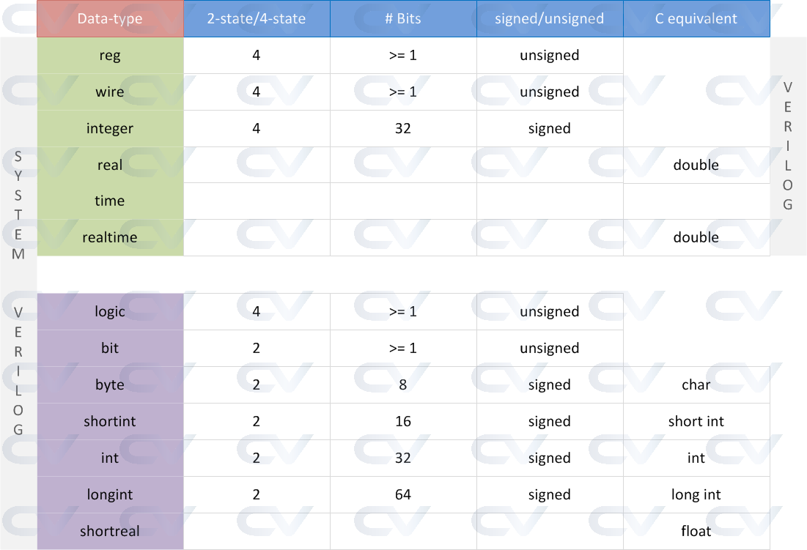

# System Verilog

## 1. Introduction

SystemVerilog is a hardware description and verification language that extends and enhances the capabilities of the Verilog hardware description language. It was standardized as IEEE 1800 and has become a widely used language in the field of digital design and verification, especially in the semiconductor industry. SystemVerilog combines features for both design and verification, making it a versatile language for creating and testing digital systems.

## 2. Data Types

`list is data types supported by System Verilog`



### 2.1 Strings

`String` can hold multiple lines by using `""` character.
to store string in an integral type, each character will require 8 bits

```sv
byte        letter2 = "A";
bit   [7:0] letter1 = "B";
```

### 2.2 Structs

`Struct` is a user-defined data type that can hold multiple data types. It is similar to `class` in C++.

```sv
struct {
    bit [7:0] a;
    bit [7:0] b;
} my_struct;
```
Example:

```sv